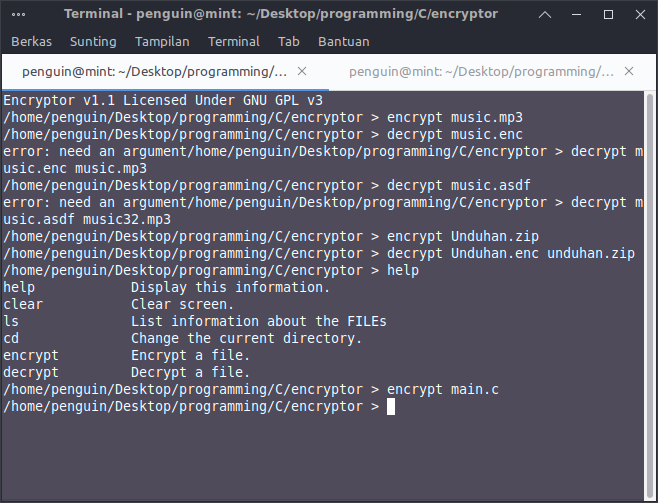
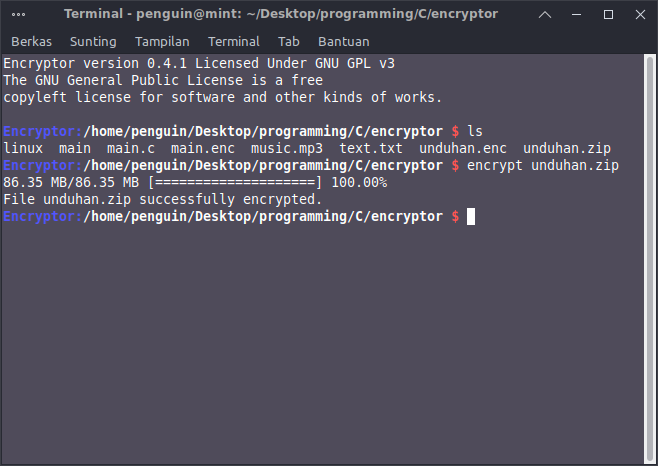
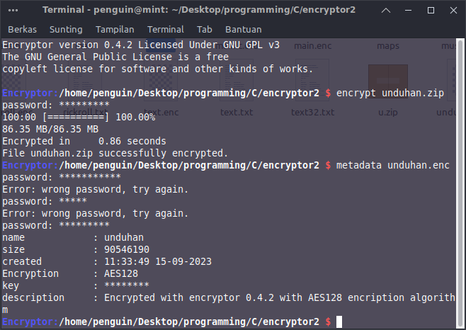

# Encryptor AES128

## Screenshot 1


## Screenshot 2


## Screenshot 3


Ini adalah aplikasi yang dapat digunakan untuk enkripsi dan dekripsi dengan AES128. Aplikasi ini diprogram dalam bahasa C dan memiliki beberapa fitur

## Features

- Enkripsi dan dekripsi menggunakan AES128
- Kalkulator sederhana dapat digunakan untuk menyembunyikan shell encryptor

## Usage

Cara menggunakan di Linux

1. Compile the program:

    ```bash
    gcc encryptor.c -o encryptor
    ```
2. Run the shell:

    ```bash
    ./encryptor password
    ```

3. Encrypt a file:

    ```bash
    encrypt file_name
    ```

   This will encrypt `file_name` and save it with the `.enc` extension.

4. Decrypt a file:

    ```bash
    decrypt encrypted_file decrypted_result
    ```

   This will decrypt `encrypted_file` and save the result as `decrypted_result`.

Cara menggunakan di Android

1. Install Termux melalui playstore

2. Install gcc dengan `pkg install clang` di termux

3. Gunakan cara yang sama seperti penggunaanya di Linux

## Note

- Password "12345678"

## License

This project is licensed under the GNU GPL v3. See the [LICENSE](LICENSE) file for more information.

---

Created by Kutu Komputer

Catatan: next update akan menggunakan enkripsi AES256, jadi aplikasi ini bisa untuk menyembunyikan file, untuk menjalankan aplikasi ini di Android kalian harus menggunakan Termux
